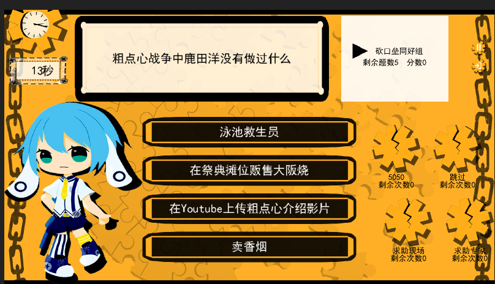

# 简介

一个答题游戏（一站到底）。含有libgdx框架实现的桌面端和网页端。或许还可将其中的答题业务逻辑复用于其他项目，获得不同的前端实现。

# 项目结构

- 子项目`quiz-lib`：和前端无关的答题业务逻辑，或许可以复用于其他项目。
- 子项目`core`：libgdx框架的core子项目。
- 子项目`destop`：libgdx框架的destop子项目，可打包出libgdx桌面端应用。
- 子项目`html`：libgdx框架的html子项目，可打包出libgdx HTML端应用。[在线游玩](https://hundun.itch.io/zaca-quiz)
- 子项目`swing-destop`：不使用libgdx框架，仅使用swing制作桌面端应用。是一种复用`quiz-lib`的样例。

# 其他

- [StillStanding项目](https://github.com/hundun000/StillStanding)。曾经的桌面端+lib实现，使用GMS游戏引擎。
- [quizgame-server项目](https://github.com/hundun000/quizgame)。曾经的Server端+lib实现，使用SpringBoot。

本项目的前端UI迭代自StillStanding项目；答题业务逻辑迭代自quizgame-server项目。